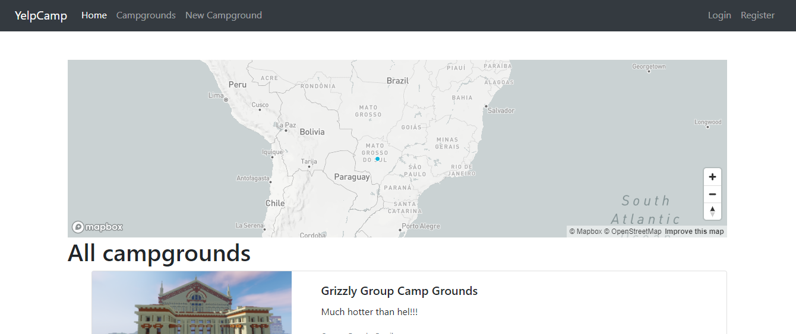

# MyCodeYelpCampgrounds
## O que é?

  É um site de compartilhamento de acampamentos, onde os usuários podem se cadastrar e compartilhar e dar reviews dos acampamentos que foram ou conhecem.

## Status de desenvolvimento
<h4 align="center"> 
	🚧  MyCodeYelpCamp Pronto para uso...  🚧
</h4>

Falta correção de pequenos bugs, como corrigir formatação em algums páginas.

## Resultado final (Deploy)

	O site está online no domínio:
	<h4 align="center"> 
	https://mycodeyelpcamp.herokuapp.com/
</h4>

## Layout

	

	
## Como foi feito
### Front-end

	Primeiro foi feito uma página sem estilização ou css. 
	Após, foram feitos diversos componentes reutilizáveis que ficaram dentro da pasta views/partials.
	Para ajudar na integração de javascript com HTML usou-se EJS.

### Back-end

	O começo do projeto foi feito tudo somente o arquivo app.js. 
	Conforme se adicionava funcionalidades, mais rotas e páginas foram criadas e precisou dividir o código em arquivos diferentes.
	O controle das rotas ficaram nos arquivos dentro da pasta /routes. E o controle das ações e controles ficaram nos arquivos dentro da pasta /controlers.

## Funcionalidades
<ul>
	<li>Registro de usuário</li>
	<li>Login e logout</li>
	<li>Adição de reviews em acampamentos</li>
	<li>Remoção dos reviews dados</li>
	<li>Cadastro de acampamentos</li>
	<li>Edição das informações dos acampamentos cadastrados</li>
	<li>Remoção dos acampamentos cadastrados</li>
	</ul>
